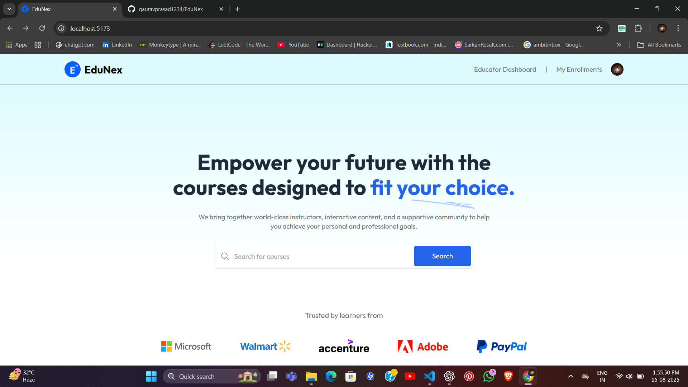

# Edunex - Learning Management System

Edunex is a modern Learning Management System (LMS) designed to streamline online education for students and educators. It provides robust features for authentication, course management, role-based access control, and secure payment integration.

## Project Logo



_Add your project logo above by replacing `path/to/your/logo.png` with the actual image path or URL._


## Priority Zero Features

- **Authentication**: Secure login and registration for all users.
- **Course Management**: Create, update, and manage courses.
- **Role-Based Access Control**: Separate dashboards and permissions for Students, Educators, and Admins.
- **Student Enrollment**: Students can enroll in courses.
- **Payment Gateway Integration**: Secure payments for course enrollment.

## Table of Contents

- [Features](#features)
- [Tech Stack](#tech-stack)
- [Getting Started](#getting-started)
- [Project Structure](#project-structure)
- [Contributing](#contributing)
- [License](#license)

## Features

- User authentication (JWT/OAuth)
- Role-based dashboards (Student, Educator, Admin)
- Course creation, editing, and deletion
- Student enrollment and progress tracking
- Payment gateway integration (Stripe/PayPal)
- Responsive UI

## Tech Stack

- **Frontend**: React.js / Next.js
- **Backend**: Node.js / Express.js
- **Database**: MongoDB / PostgreSQL
- **Authentication**: JWT / OAuth 2.0
- **Payments**: Stripe / PayPal

## Getting Started

1. **Clone the repository**
    ```bash
    git clone https://github.com/yourusername/edunex.git
    cd edunex
    ```

2. **Install dependencies**
    ```bash
    npm install
    # or
    yarn install
    ```

3. **Configure environment variables**
    - Copy `.env.example` to `.env` and update values.

4. **Run the application**
    ```bash
    npm run dev
    # or
    yarn dev
    ```

5. **Access the app**
    - Open [http://localhost:3000](http://localhost:3000) in your browser.

## Project Structure

```
/edunex
  /backend
     /controllers
     /models
     /routes
     /middlewares
  /frontend
     /components
     /pages
     /styles
  /config
  .env.example
  README.md
```

## Contributing

Contributions are welcome! Please open issues and submit pull requests for improvements.

## License

This project is licensed under the [MIT License](LICENSE).

---

**Edunex** - Empowering Education, Simplifying Learning.